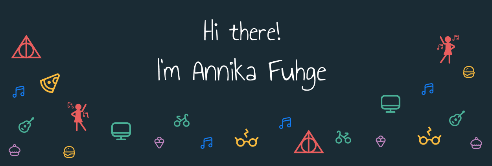

Hi there 👋

I'm Annika and a passionate frontend developer. 
I'm currently working at [CompuGroup Medical SE & Co. KGaA](https://www.cgm.com/).  
In my free time, I love to let my creativity run wild and develop my own projects with a focus on design. 🤯

- 💬 Ask me about everything you like
- 📫 How to reach me: annikafuhge96@gmail.com
- ⚡ Fun fact: I'm a huge Harry Potter fan, so I got the nickname Annie Fudge.

## 🌟 Skills
### Languages

### Frameworks

### Databases

### Testing

### CI

### Version Control

### Design

### Other

## ❤️ Hobbies
- 💃 Dancing
- 🧶 Crocheting
- 🍻 Meeting friends

